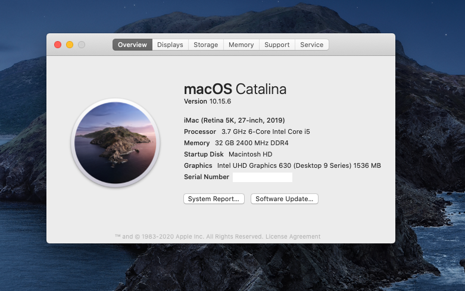

# Hackintosh Catalina Guide for Gigabyte Z390 Aorus Pro Wifi (OpenCore)

This is a fork of https://github.com/cmer/gigabyte-z390-aorus-master-hackintosh with alterations to work on
Gigabyte Z390 AORUS PRO WIFI, instead of Gigabyte Z390 AORUS PRO Master.

I first attempted to use https://github.com/blacklizard/gigabyte-z390-aorus-pro-wifi-hackintosh-opencore
but wasn't able to get it to boot. (I may have constructed the EFI incorrectly.)

The EFI from cmer's AORUS PRO MASTER booted up on the first try, but with
no Ethernet, some disabled USB ports, and no iGPU hardware acceleration. With some fixes, my system is now
working.

--

This build is "Vanilla". I used [this guide](https://dortania.github.io/OpenCore-Desktop-Guide/) as a starting point.

### Hardware

See my [Hardware List](HARDWARE.md)

### What's Working/What's Not

I haven't yet done extensive tests. Will update this later.

### Step By Step Instructions

My old Clover guide used to have Step by Step instructions but I decided not to write such instructions here for two reasons: it's a pain to keep up to date, and I literally just followed the [OpenCore Desktop Guide](https://dortania.github.io/OpenCore-Desktop-Guide/). When in doubt, just look at my KEXTs, drivers and config.list for guidance.

### USB Port Map & SSDT

See [USB_MAP.md](USB_MAP.md) for a map of all the ports on the Z390 AORUS PRO WIFI.

### My EFI

You are welcome to use my EFI folder. However, make sure you set the following:

- SystemSerialNumber
- SystemUUID
- MLB
